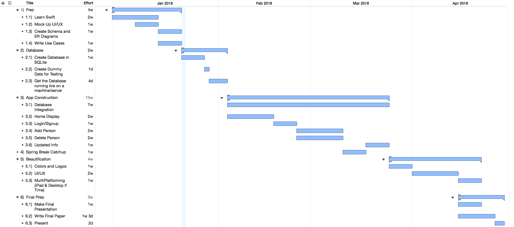

# StreetCheck
An app used by law enforcement to supplement their street check log books

## Gantt Chart

## Use Cases
	1. As a user who wants to maintain a record of appearance would like to be able to store a profile photo.
	2. As a user who may need to update information would like to be abkle to change and update all of my fields.
	3. As a user who would like to keep my data secure would like to have a password/passcode that keeps my app secure.
	4. As a user in order to ahve the most accurate data, would like to create as many custom fields as I wish.
	5. As a user who wants to maintain and uphold legal rules around this information would like the app to auto-delete information after 5 years if it has gone unupdated.
	6. As a user who may not know an individuals name would like to be able to filter all of my data by certain key attributes.
	7. As a user who may be seeking specific information very quickly, would like the ablility to search through all of my data.
	8. As a user who wants to be compliant with regulations would like to be able to view said regulations in-app.
	9. As a user who would like to monitor individuals connections would like to be able to create an "organization" of multiple individuals.
	10. As a user in order to have the most data possible would like to have an individual notes section for each individual as well as a global generic note area.
