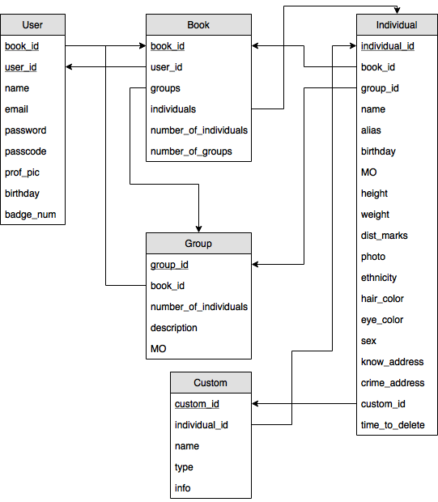
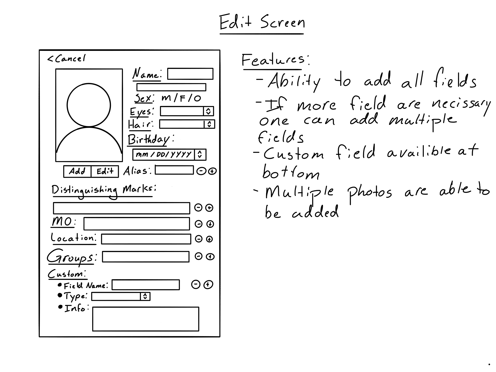
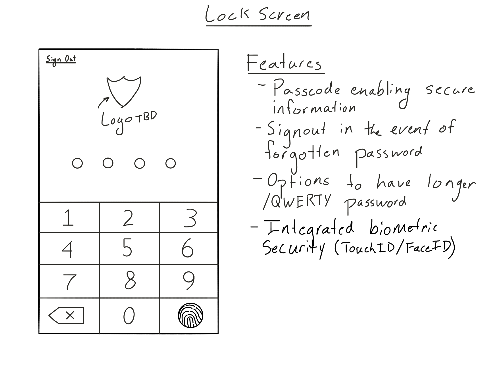
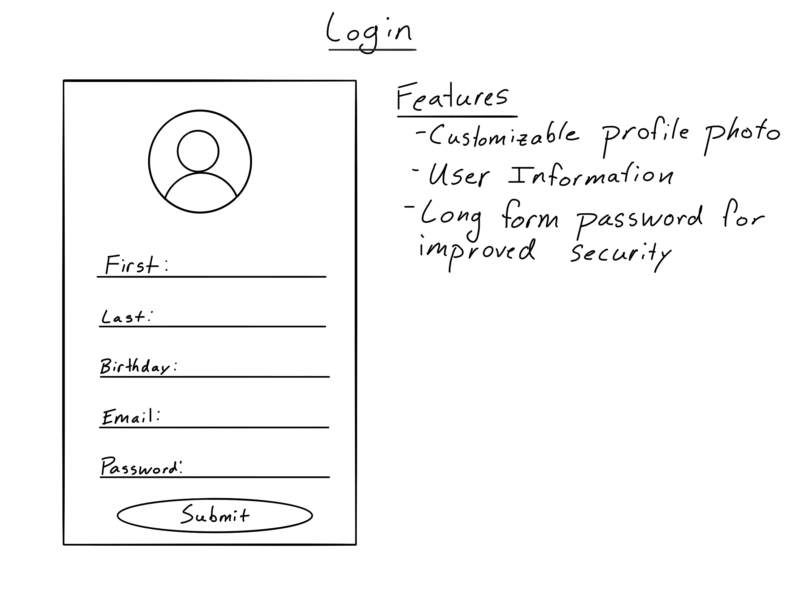
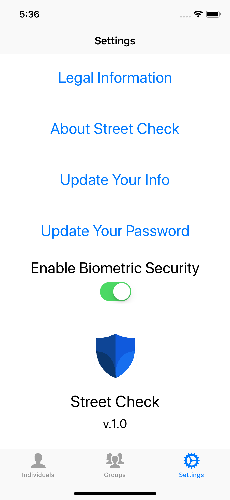

# StreetCheck
Street Check is an app designed for the use of law enforcement officers. The app supports many features that help streamline the process of keeping records and noting crimes. 

Features:

1. Store contacts with specific markers and fields used in the process of law enforcement.
1. Ability to modify the layout to best conform to either a larger image or minimizing to show more people at once.
1. Area for both individuals and groups that are kept distinct and separate.
1. Search on a filter functionality to enable quick lookup in regards to specific unique traits.
1. Ability to edit and modify entries to keep records up to date.
1. Information that displays the last updated time that, if a contact goes un-updated will be deleted after five years to comply with federal and state law.

Security:

1. All information is stored locally on the device and is never transmitted or kept by the developer.
1. A secure interface requiring a password for re-entry.
1. Ability to enable biometric security for further security using either Touch ID or Face ID.

Future Updates:
Many new features are coming to the app very soon!

1. Ability to add car make and model information for when an individual is pulled over
1. Updated to groups that integrate individuals into them so you can pass from a group to an individual in that group
1. Improvements to the UI and speed of the app
1. Dark mode for nighttime patrols
1. Better branding and color improvements to the app
1. Custom fields for more extra information

Thank you so much for using the application. If you have suggestions for the app leave a rating and review with your feedback.

## App Store URL
https://itunes.apple.com/us/app/street-check/id1368862438?mt=8

## Gantt Chart

## Use Cases
1. As a user who wants to maintain a record of appearance would like to be able to store a profile photo.
2. As a user who may need to update information would like to be abkle to change and update all of my fields.
3. As a user who would like to keep my data secure would like to have a password/passcode that keeps my app secure.
4. As a user who wants to maintain and uphold legal rules around this information would like the app to auto-delete information after 5 years if it has gone unupdated.
5. As a user who may not know an individuals name would like to be able to filter all of my data by certain key attributes.
6. As a user who may be seeking specific information very quickly, would like the ablility to search through all of my data.
7. As a user who wants to be compliant with regulations would like to be able to view said regulations in-app.
8. As a user who would like to monitor individuals connections would like to be able to create an "organization" of multiple individuals.
9. As a user in order to have the most data possible would like to have an individual notes section for each individual as well as a global generic note area.

## Schema Diagram

## ER Diagram

## UI Mock Up

## Logo Mock Up

## App Screenshots

